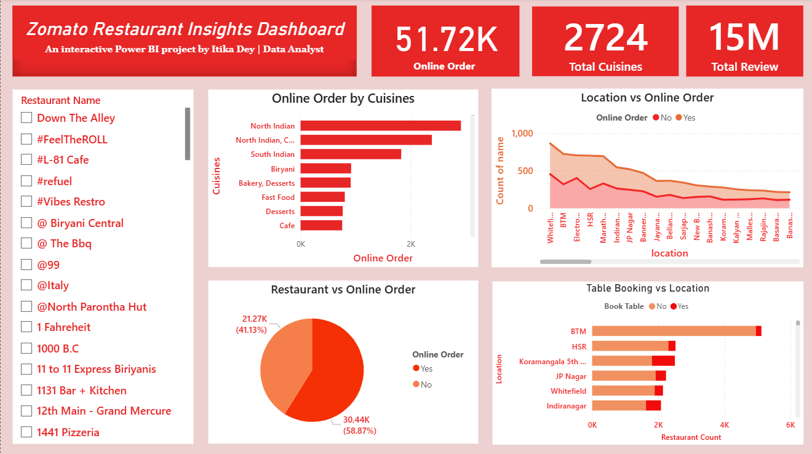

# Zomato Restaurant Data Analysis

An end-to-end data analysis project using the Zomato dataset.

## Tools Used
- Python (Pandas)
- Jupyter Notebook
- Power BI (for dashboard)

## Key Insights
- Online order trends by cuisine and city
- Table booking availability by restaurant type
- Cost analysis and customer ratings

## Dashboard Preview

## Files Included
- `Zomato_Clean.ipynb` – Jupyter Notebook
- `Zomato_Cleaned.csv` – Cleaned dataset

## 📁 Project Files (Google Drive)

Due to file size limits on GitHub, the full dataset is available via Google Drive

🔗 [Click here to access files](https://drive.google.com/drive/folders/11cj4U94kanU6BM3v12t3UmAKuK4FaFxb?usp=sharing)

---
By Itika Dey • Aspiring Data Analyst
